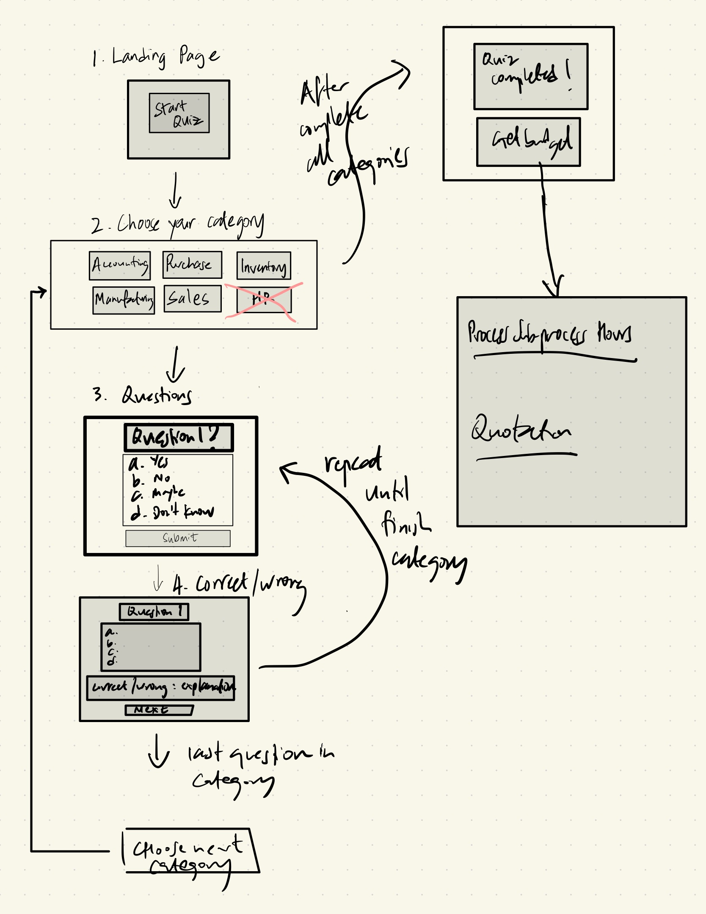

# Project Budget Estimator Quiz


# Description

While the project was meant to be fun, the aim of doing this course was to help my business hence, I decided to create a simple quiz game to solve the following 2 problems:

1. Prospective clients want a budget but to provide a realistic budget, we have to conduct a discovery process to find out their needs and their level of business/technical understanding to allocate resources accurately.
2. Current clients: overestimation of their understanding leading to budget overruns.

Doing so will help us to reduce time spent on the discovery process as well as provide a personalised budget based on their needs. 

# Link to deployed game

[Project Budget Estimator Quiz](https://lovely-creponne-4699b1.netlify.app/)

# Instructions for MVP

- Start quiz
- There will be different categories: Inventory, Accounting etc.
- When they choose the category, there will be several questions testing the key concepts.
- It will be a multiple choice quiz.
- There will be a correct answer that awards full points: 2.
- There will be an answer that somewhat tells us that they have limited understanding awarding 1.
- Wrong aswers will be 0.
- After they answer the questions, it will tally up the points for the category.
- Then, a set number of hours will be given for various levels of understanding. 8 hours if expert understanding (above 75%), 16 hours if good understanding (between 50% and 75%), 24 hours if limited understandng (below 50%) etc. 
- The cost will be tallied up based on cost/hour and then, a final budget with hours will be displayed to the client. 

# Planning materials 

## User stories 

1. When I arrive on the landing page, I want to see a Start Quiz button in the middle of the page.
2. When I press the start button, a few buttons to choose your category will show up.
3. After I press the category, the first question will show up with 4 possible multiple choice answers and a submit answer button. 
4. When I click the correct answer and submit, there will be a message saying "Correct!" with an explanation. 
5. When I click the wrong answer and submit, there will be a message saying "Wrong" with the correct answer and explanation. 
6. There will be a next question button that appears after that and it will lead to the next question. 
7. After answering all the questions in the category, there will be message saying you have completed all questions in this category and a choose your next category will show up.
8. Pressing the next category button will lead back to the #2 with the categories completed no longer showing. 
9. Finally, when all categories are finished, there will be message saying you have completed your quiz.
10. A "get budget" button will appear and the final budget will be displayed on the screen.
11. A reset button will be there to reset back to #1.

## wireframes / html + css



## model / state

Categories will be an array of objects: `[{category: "Accounting", score: 0, completed: false}]`

Questions will be an array of objects: `[{question: "Accounting", answers: ["1","2","3","4"], correctAnswer: "1", semiCorrectAnwer: "2", category: "Accounting", Explanation: "xyz"}]`
    
# Attributions

- Style Framework: [Bootstrap](https://getbootstrap.com/docs/5.3/getting-started/introduction/)
- Sounds: [Pixabay](https://pixabay.com/sound-effects/)
- Stack Overflow, w3 schools, MDN
- ChatGPT

# Technologies Used

HTML + CSS + Javascript

# Stretch goals

- I should probably ask and let the users choose what modules/categories they are interested in at the start before starting the quiz.
- There should be sub-processes within the processes and break it up so we can be more granular in the budgeting process. 

# Reflections

## Favorite code

```
const showOnlyContainer = (...containers) => {
  allDivs.forEach(div => {
    div.classList.remove('show');
  });
  containers.forEach(container => {
    container.classList.add('show');
  });
}
```
- Currently, my code can handle any number of categories, any number of questions and the table will update accordingly. 

## Can do better
- After doing the project, I realised I probably did not need to create a `const myCategories`. I could have just created it as a state/variable by filtering out the categories from the questions.
- Put the scoring mechanism outside of the displayBudgetTable function and create another function called calculateScore


